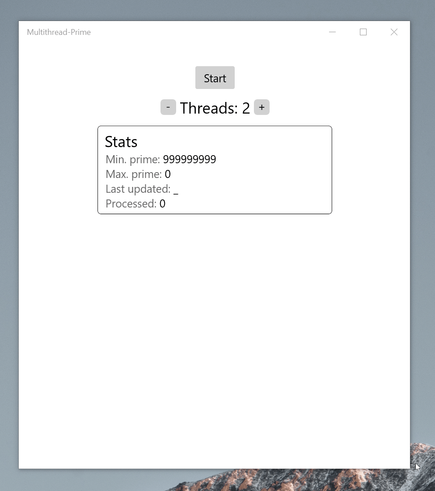

# Multi-thread prime number checker

Assignment for the third laboratory of Seecure Programming from the univeristy VGTU from Lithuania.

The end result is an application following the **Producer-Consumer pattern** that gets every file from the folder *Desktop\Practical.Work3\rand_files* (i know, hardcoded folder path), and searches in every file for prime numbers. This search is done with the amount of threads decided by the user and adjust dynamically.

	

